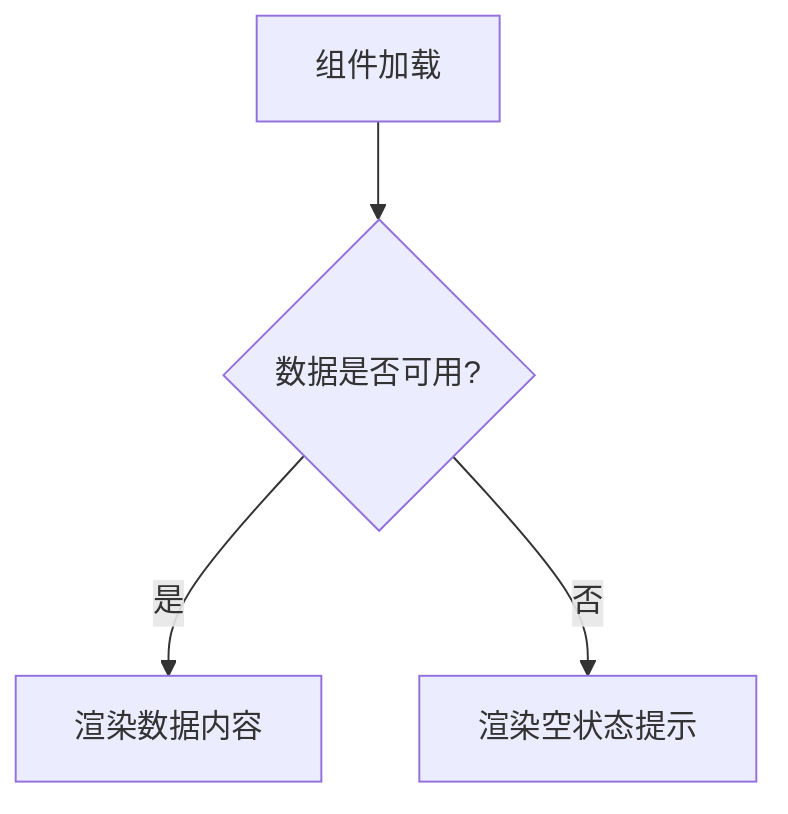

# Design Doc Writer

## 概述

这个 Skill 专门负责更新设计文档。它会根据需求和确认的方案，更新或创建 docs/design 目录下的相关设计文档。设计文档是系统的"蓝图"，必须保持纯粹性，只描述最终状态，不包含修改历史。

## ⚠️ 核心铁律 (CRITICAL)

### 1. 禁止滥用 `README.md`
**`README.md` 仅作为目录索引，严禁将具体的设计内容（如表结构、API 定义）写入 `README.md`。**

### 2. 文件名即内容
**文件名必须精准反映其包含的业务实体或功能模块**（如 `Order.yaml`, `login-flow.md`），确保文件命名具有自描述性。

### 3. 格式分层原则
- **结构化数据 (Data Model)** 必须用 **YAML**：确保类型精确，无歧义
- **逻辑说明 (API/Features)** 必须用 **Markdown**：描述契约与交互

## 使用场景

当用户使用 `/dt` 或 `/dt-design` 命令时，这个 Skill 会在第三阶段被调用，用于：
1. 基于确认的方案更新设计文档
2. 创建新的设计文档（如需要）
3. 确保文档结构统一和内容规范
4. 记录文档更新历史（存储在 .design-update/ 目录）

## 模板文件

这个 Skill 使用以下模板文件：

1. **通用设计文档模板**：`universal_design_template.md`
   - 用途：创建通用的 Markdown 设计文档
   - 位置：用于 Features、Architecture、Guides 等

2. **实体模型模板**：`entity_template.yaml`
   - 用途：定义数据结构、实体模型、数据库表结构等
   - 位置：`docs/design/backend/Data-Model/<EntityName>.yaml`
   - **格式**：YAML（强制要求）

3. **API 端点模板**：`api_endpoint_template.md`
   - 用途：描述接口契约、业务流程、状态机等
   - 位置：`docs/design/backend/API-Reference/<Module>-endpoints.md`
   - **格式**：Markdown（强制要求）

4. **更新记录模板**：`design_update_record_template.md`
   - 用途：记录文档变更历史

5. **清单模板**：`manifest_template.json`
   - 用途：生成项目索引地图

6. **项目结构模板**：`project_structure_template.md`
   - 用途：展示标准目录结构和命名规范

### 模板结构：

#### Data-Model（YAML）模板：
```yaml
# <EntityName>.yaml
entity: <EntityName>
table: <table_name>
columns:
  - name: <field_name>
    type: <DATATYPE>
    nullable: <true|false>
```

#### API/Features（Markdown）模板：
```markdown
# <文档标题>
## 概述
## 详细设计
### <接口/功能名称>
**功能**：<描述功能意图>
**交互逻辑**：
- 输入：<关键参数>
- 处理：<业务逻辑>
- 输出：<响应格式>
```

## 更新记录模板

这个 Skill 使用专门的更新记录模板：`design_update_record_template.md`

更新记录存储在 `.design-update/` 目录下，用于追踪设计文档的变更历史。

## 工作流程

### 第 1 步：读取模板

根据文档类型选择对应的模板：
- **Data-Model 文档**：读取 `assets/entity_template.yaml`
- **API-Reference 文档**：读取 `assets/api_endpoint_template.md`
- **通用文档**：读取 `assets/universal_design_template.md`

### 第 2 步：更新或创建文档

基于用户需求和确认的方案：

1. **更新现有文档**：
   - 使用 Read 工具读取现有文档
   - 根据方案内容更新文档的"详细设计"部分
   - 更新"涉及文件"和"相关文档"部分
   - **注意**：Data-Model 必须保持 YAML 格式，API/Features 必须保持 Markdown 格式

2. **创建新文档**：
   - 根据目录类型选择对应模板
   - 使用 YAML 模板创建 `Data-Model` 目录下的文档
   - 使用 Markdown 模板创建 `API-Reference`、`Features`、`Components` 等目录下的文档
   - 填充文档标题、概述、详细设计等内容
   - 确保文件命名符合规范（`<EntityName>.yaml` 或 `<Module>-endpoints.md` 等）

### 第 3 步：验证文档内容

确保文档符合规范：
- **内容纯粹性**：只描述最终设计状态，无修改历史
- **格式规范**：
  - **Data-Model**：必须使用 YAML 格式，字段定义清晰
  - **API/Features**：必须使用 Markdown 格式，逻辑描述完整
  - 使用表格、列表、Mermaid 图表等增强可读性
- **命名规范**：文件名必须精准反映业务实体或功能模块
- **双向链接**：明确文档间的引用关系
- **涉及文件**：列出所有相关的代码文件路径

### 第 4 步：记录更新历史

读取更新记录模板：
```bash
Read: assets/design_update_record_template.md
```

在 .design-update/ 目录下记录更新历史：
- 基于模板创建时间戳文件（格式：YYYY-MM-DD-design-updates.md）
- 记录更新的文档名称和位置
- 记录文档类型（YAML Data-Model 或 Markdown API/Features）
- 保存修改摘要

### 第 5 步：更新 manifest.json（重要）

完成文档更新后，**必须**生成或更新项目的 `docs/manifest.json` 文件：

**生成时机**：
- 此步骤在 `/dt` 或 `/dt-design` 流程的最后一步自动执行
- 当设计文档发生任何更新时，manifest.json 需要同步更新

**功能作用**：
- 作为项目的"索引地图"，供后续流程读取
- 加速文档检索并支持无状态 Agent 快速理解项目
- 提供项目的整体结构和技术栈信息
- **区分文档类型**：明确标注哪些是 YAML Data-Model，哪些是 Markdown API/Features

**数据来源**：
- 扫描 `docs/design/` 目录结构
- 分析文档内容，提取模块信息
- 识别文件类型（.yaml 或 .md）
- 从文档中识别技术栈信息

**数据结构**：
```json
{
  "project_name": "项目名称",
  "last_updated": "ISO-8601时间戳",
  "tech_stack": {
    "backend": "框架/语言",
    "frontend": "框架/语言",
    "database": "数据库类型"
  },
  "directory_structure": {
    "backend": {
      "Data-Model": "docs/design/backend/Data-Model/*.yaml",
      "API-Reference": "docs/design/backend/API-Reference/*.md",
      "Features": "docs/design/backend/Features/*.md"
    }
  },
  "index_map": {
    "backend_entry": "docs/design/backend/Architecture/Overview.md",
    "frontend_entry": "docs/design/frontend/Architecture/Overview.md",
    "data_models": [
      { "name": "Order", "path": "docs/design/backend/Data-Model/Order.yaml", "type": "entity" },
      { "name": "User", "path": "docs/design/backend/Data-Model/User.yaml", "type": "entity" }
    ],
    "api_modules": [
      { "name": "Auth Endpoints", "path": "docs/design/backend/API-Reference/auth-endpoints.md", "type": "api" }
    ]
  }
}
```

**实现步骤**：
1. 使用 Bash 工具扫描 docs/design 目录结构
2. **按文件类型分类**：
   - `.yaml` 文件归类到 `data_models`
   - `.md` 文件归类到 `api_modules` 或 `features` 或 `components`
3. 分析文档内容，提取技术栈和模块信息
4. 生成 JSON 数据结构
5. 保存到 `docs/manifest.json`

**注意事项**：
- manifest.json 是自动生成文件，**不要**手动编辑
- 如果文件已存在，应更新而非覆盖
- 确保 JSON 格式正确且可解析
- **严格区分**：Data-Model（YAML）和 API/Features（Markdown）

## Mermaid 图表规范

当需要展示流程、时序、状态或关系结构时，必须使用 Mermaid 语法：

**语法注意事项**：
- **必须使用半角符号**：所有标点符号（逗号、分号、括号等）必须是半角字符
- **注意换行**：Mermaid 图表需要正确换行

**示例**：


## 目录与命名规范详情

### Backend Design (后端)

| 目录 | 推荐格式 | 命名规则 | 说明 |
| :--- | :--- | :--- | :--- |
| **Data-Model/** | **`.yaml`** | `<EntityName>.yaml` | **必须用 YAML**。利用 YAML 的层级特性清晰定义字段、类型、枚举、约束和索引。方便后续生成 SQL/ORM 代码。 |
| **API-Reference/** | **`.md`** | `<Module>-endpoints.md` | **必须用 Markdown**。描述接口契约、交互逻辑、关键参数和意图。**不要**生成原始的 OpenAPI/Swagger YAML（那个由代码生成）。 |
| **Features/** | `.md` | `<verb>-<noun>.md` | 描述具体业务流程、状态机或复杂算法。 |
| **Architecture/** | `.md` | `<topic>.md` | 系统概览、技术选型等。 |

### Frontend Design (前端)

| 目录 | 推荐格式 | 命名规则 | 说明 |
| :--- | :--- | :--- | :--- |
| **Components/** | `.md` | `<ComponentName>.md` | 对应具体组件名，描述 Props、State 和交互。 |
| **Architecture/** | `.md` | `<topic>.md` | 路由结构、状态管理设计等。 |

## 标准目录结构示例

```
docs/design/
├── backend/
│   ├── Data-Model/                  # [YAML] 结构化定义，代码生成的依据
│   │   ├── User.yaml                # User 实体定义
│   │   └── OrderConfig.yaml         # 订单配置表定义
│   ├── API-Reference/               # [Markdown] 逻辑契约，给人与AI读
│   │   ├── auth-endpoints.md        # 登录/注册接口逻辑
│   │   └── payment-contract.md      # 支付回调与处理契约
│   ├── Features/
│   │   └── order-state-machine.md   # 订单状态流转逻辑
│   └── Architecture/
│       └── tech-stack.md
└── frontend/
    ├── Components/
    │   ├── NavBar.md
    │   └── UserProfileCard.md
    └── Style-Guide/
        └── theme-tokens.md
```

## 输出格式

返回文档更新信息：
- **已更新的文档**：文档路径和标题
- **已创建的文档**：新文档路径和标题
- **更新记录文件**：.design-update/ 目录下的记录文件路径
