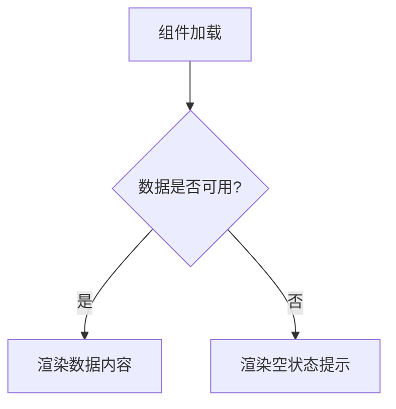

# Design Doc Writer

## 概述

这个 Skill 专门负责更新设计文档。它会根据需求和确认的方案，更新或创建 docs/design 目录下的相关设计文档。设计文档是系统的"蓝图"，必须保持纯粹性，只描述最终状态，不包含修改历史。

## 使用场景

当用户使用 `/dt` 或 `/dt-design` 命令时，这个 Skill 会在第三阶段被调用，用于：
1. 基于确认的方案更新设计文档
2. 创建新的设计文档（如需要）
3. 确保文档结构统一和内容规范
4. 记录文档更新历史（存储在 .design-update/ 目录）

## 模板使用

这个 Skill 使用统一的设计文档模板：`universal_design_template.md`

模板结构：
```markdown
# <文档标题>
## 概述
## 涉及文件
## 相关文档
## 详细设计
```

## 更新记录模板

这个 Skill 使用专门的更新记录模板：`design_update_record_template.md`

更新记录存储在 `.design-update/` 目录下，用于追踪设计文档的变更历史。

## 工作流程

### 第 1 步：读取模板

读取通用设计文档模板：
```bash
Read: assets/universal_design_template.md
```

### 第 2 步：更新或创建文档

基于用户需求和确认的方案：

1. **更新现有文档**：
   - 使用 Read 工具读取现有文档
   - 根据方案内容更新文档的"详细设计"部分
   - 更新"涉及文件"和"相关文档"部分

2. **创建新文档**：
   - 使用模板创建新文档
   - 填充文档标题、概述、详细设计等内容
   - 确保文档结构符合规范

### 第 3 步：验证文档内容

确保文档符合规范：
- **内容纯粹性**：只描述最终设计状态，无修改历史
- **格式规范**：使用表格、列表、Mermaid 图表等
- **双向链接**：明确文档间的引用关系
- **涉及文件**：列出所有相关的代码文件路径

### 第 4 步：记录更新历史

读取更新记录模板：
```bash
Read: assets/design_update_record_template.md
```

在 .design-update/ 目录下记录更新历史：
- 基于模板创建时间戳文件（格式：YYYY-MM-DD-design-updates.md）
- 记录更新的文档名称和位置
- 保存修改摘要

## Mermaid 图表规范

当需要展示流程、时序、状态或关系结构时，必须使用 Mermaid 语法：

**语法注意事项**：
- **必须使用半角符号**：所有标点符号（逗号、分号、括号等）必须是半角字符
- **注意换行**：Mermaid 图表需要正确换行

**示例**：


## 文档结构规范

### 后端设计文档

- `docs/design/backend/API-Reference/` - API 接口定义
- `docs/design/backend/Architecture/` - 宏观架构图、技术选型
  - `Overview.md` - **必须**：项目总体架构说明文档
- `docs/design/backend/Data-Model/` - 数据库模型、实体关系图
- `docs/design/backend/Features/` - 按功能模块描述业务逻辑
- `docs/design/backend/Guides/` - 开发指南、错误码定义
- `docs/design/backend/Testing/` - 测试策略和范围

### 前端设计文档

- `docs/design/frontend/Architecture/` - 宏观架构、状态管理
  - `Overview.md` - **必须**：项目总体架构说明文档
- `docs/design/frontend/Components/` - 组件设计文档
- `docs/design/frontend/Data-Structures/` - 前端数据结构设计
- `docs/design/frontend/Guides/` - 开发指南、代码风格
- `docs/design/frontend/Style-Guide/` - 视觉设计规范
- `docs/design/frontend/Testing/` - 测试策略和范围

## 输出格式

返回文档更新信息：
- **已更新的文档**：文档路径和标题
- **已创建的文档**：新文档路径和标题
- **更新记录文件**：.design-update/ 目录下的记录文件路径
