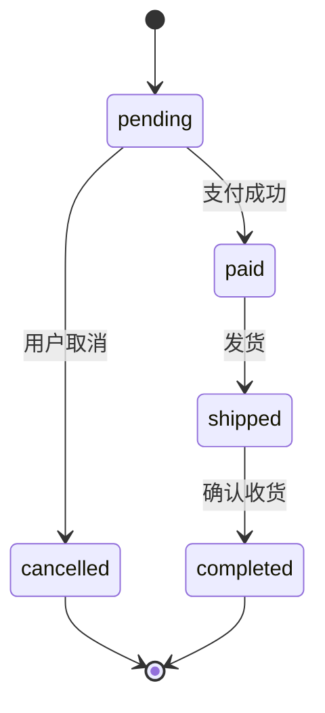

# <Module> Endpoints

## <EndpointName>
**功能**：<描述功能意图>

**交互逻辑**：
- 输入：<关键参数和格式>
- 处理：<业务处理流程>
- 输出：<响应格式和意义>

**状态流转**（如适用）：

```mermaid
stateDiagram-v2
    [*] --> pending
    pending --> paid : 支付成功
    pending --> cancelled : 用户取消
    paid --> shipped : 发货
    shipped --> completed : 确认收货
    cancelled --> [*]
    completed --> [*]
```

**错误处理**：
- `<错误码>`：<描述什么情况下会触发>
- `<错误码>`：<描述如何处理>
