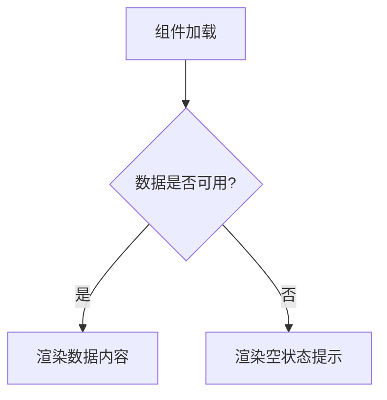

# <文档标题>

## 概述
<简要描述本文档的目的和核心内容>

## 涉及文件
- `src/path/to/file1.js`
- `src/path/to/file2.py`
- (如果文件不存在，则写"无"或"待创建")

## 相关文档
- **引用的文档**:
  - [../Data-Model/User.md](../Data-Model/User.md)
  - [../API-Reference/auth.yaml](../API-Reference/auth.yaml)
- **被引用的文档**:
  - [../Components/Business/LoginForm.md](../Components/Business/LoginForm.md)
- **技术栈参考**:
  - [../Technical-Stack/Overview.md](../Technical-Stack/Overview.md)

## 详细设计
<使用表格、列表、Mermaid图表、伪代码等展示最终的设计状态，不包含任何历史或变更信息>

### 示例：组件渲染逻辑设计
当数据可用时，组件应渲染数据内容。当数据不可用时，组件应渲染一个空状态的提示信息。

